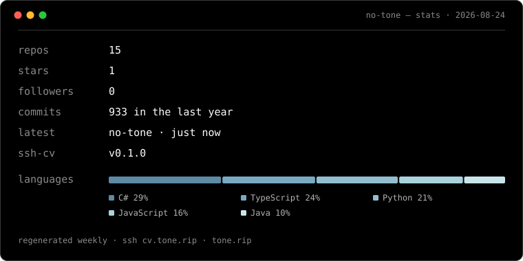

<!-- generated:start -->
<a href="https://tone.rip">
  <picture>
    <source media="(prefers-color-scheme: light)" srcset="assets/stats-light.svg">
    
  </picture>
</a>
<!-- generated:end -->

**Software engineer.** Web applications end to end — the front-end, the API
behind it, and the infrastructure both run on.

[tone.rip](https://tone.rip) · [work](https://tone.rip/work) · [cv](https://tone.rip/cv) · `ssh cv.tone.rip`

---

The field behind the wordmark isn't a picture of my site's gradient — it
*is* it, the same `renderField` run headlessly. The window is the one
<code>ssh cv.tone.rip</code> draws. <a href="scripts/">Generated here</a>,
weekly.

